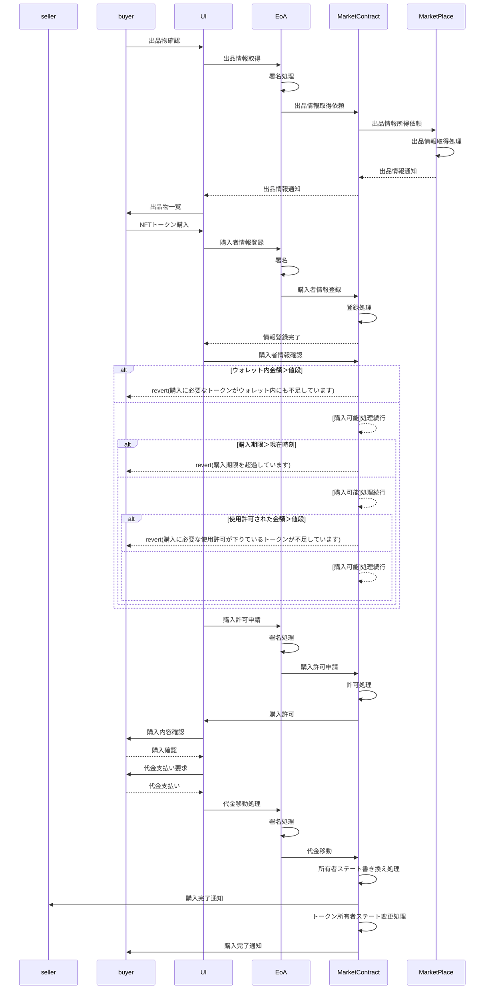

```mermaid
sequenceDiagram
    participant seller
    participant buyer
    participant UI
    participant EoA
    participant MarketContract
    participant MarketPlace
    buyer->>UI: 出品物確認
    UI->>EoA: 出品情報取得
    EoA ->>EoA: 署名処理
    EoA ->>MarketContract: 出品情報取得依頼
    MarketContract->>MarketPlace: 出品情報所得依頼
    MarketPlace->>MarketPlace:　出品情報取得処理
    MarketPlace-->>MarketContract: 出品情報通知
    MarketContract-->>UI: 出品情報通知
    UI->>buyer: 出品物一覧
    buyer->>UI: NFTトークン購入
    UI->>EoA: 購入者情報登録
    EoA->>EoA: 署名
    EoA->>MarketContract: 購入者情報登録
    MarketContract ->>MarketContract: 登録処理
    MarketContract-->>UI: 情報登録完了
    UI->>MarketContract: 購入者情報確認
    alt ウォレット内金額＞値段
        MarketContract-->>buyer: revert(購入に必要なトークンがウォレット内にも不足しています)
    else
        MarketContract-->>MarketContract: [購入可能]処理続行
        alt 購入期限＞現在時刻    
            MarketContract-->>buyer: revert(購入期限を超過しています)
        else
            MarketContract-->>MarketContract: [購入可能]処理続行
            alt 使用許可された金額＞値段
                MarketContract-->>buyer: revert(購入に必要な使用許可が下りているトークンが不足しています)
            else            
                MarketContract-->>MarketContract: [購入可能]処理続行
            end
        end
    end
    UI->>EoA: 購入許可申請
    EoA->>EoA: 署名処理
    EoA->>MarketContract: 購入許可申請
    MarketContract->>MarketContract: 許可処理
    MarketContract->>UI: 購入許可
    UI->>buyer: 購入内容確認
    buyer-->>UI: 購入確認
    UI->>buyer: 代金支払い要求
    buyer-->>UI: 代金支払い
    UI->>EoA: 代金移動処理
    EoA->>EoA: 署名処理
    EoA->>MarketContract: 代金移動
    MarketContract->>MarketContract: 所有者ステート書き換え処理
    MarketContract->>seller: 購入完了通知
    MarketContract->>MarketContract: トークン所有者ステート変更処理
    MarketContract ->>buyer: 購入完了通知
```    