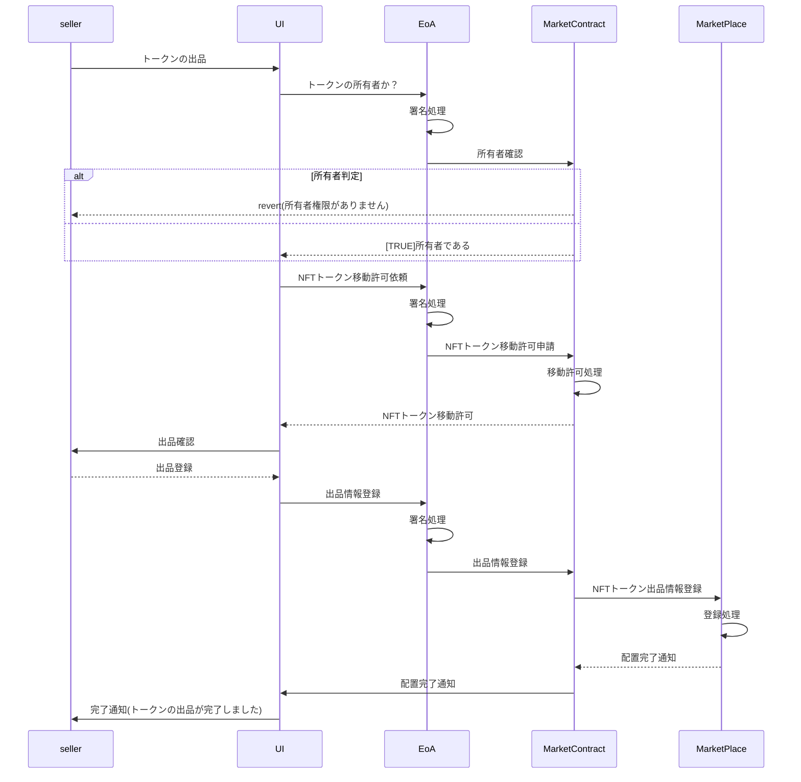

```mermaid
sequenceDiagram
    participant seller
    participant UI
    participant EoA
    participant MarketContract
    seller->>UI: トークンの出品
    UI->>EoA: トークンの所有者か？
    EoA->>EoA: 署名処理
    EoA->>MarketContract: 所有者確認
    alt 所有者判定 
        MarketContract-->>seller: revert(所有者権限がありません)
    else
        MarketContract-->>UI: [TRUE]所有者である
    end
    UI->>EoA: NFTトークン移動許可依頼
    EoA->>EoA: 署名処理
    EoA->>MarketContract: NFTトークン移動許可申請
    MarketContract->>MarketContract: 移動許可処理
    MarketContract-->>UI: NFTトークン移動許可
    UI->>seller: 出品確認
    seller-->>UI: 出品登録
    UI->>EoA: 出品情報登録
    EoA->>EoA: 署名処理
    EoA->>MarketContract: 出品情報登録
    MarketContract->>MarketPlace: NFTトークン出品情報登録
    MarketPlace ->>MarketPlace: 登録処理
    MarketPlace-->>MarketContract: 配置完了通知
    MarketContract->>UI: 配置完了通知
    UI->>seller: 完了通知(トークンの出品が完了しました)
```